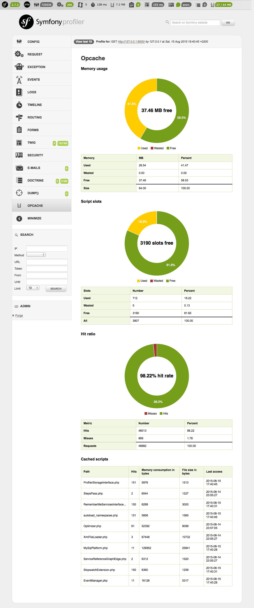

# OpcacheBundle #

## Installation ##

Install the bundle via [Composer](https://getcomposer.org):

    php composer.phar require --dev matthimatiker/opcache-bundle

Enable the bundle in your kernel:

    <?php
    // app/AppKernel.php

    public function registerBundles()
    {
        / ...
        if (in_array($this->getEnvironment(), array('dev', 'test'))) {
            // ...
            $bundles[] = new Matthimatiker\OpcacheBundle\MatthimatikerOpcacheBundle();
        }
    }
    
[Configure Twig](https://symfony.com/doc/3.2/templating/templating_service.html) as template engine in your ``config.yml``:

    framework:
        templating: { engines: ['twig'] }

## Usage ##

After bundle activation, an additional info box shows up in the profiler toolbar.
It provides quick access to the current memory usage and hit rate of the Opcache.

The detail page provides comprehensive information about memory state, cache key usage and cached scripts:

## Changelog ##

### 0.6.0 -> 0.7.0 ###

- Added support for Symfony 4 (thanks to [PabloKowalczyk](https://github.com/PabloKowalczyk))
- Dropped support for Symfony 2.3

### 0.5.0 -> 0.6.0 ###

- Added missing dependencies (thanks to [PabloKowalczyk](https://github.com/PabloKowalczyk))
- Added statistics about interned strings (thanks to [PabloKowalczyk](https://github.com/PabloKowalczyk))

### 0.4.3 -> 0.5.0 ###

- Avoid conflict on installation with [Symfony Flex](http://fabien.potencier.org/symfony4-demo.html)
- Dropped PHP 5 support
- Dropped HHVM support
